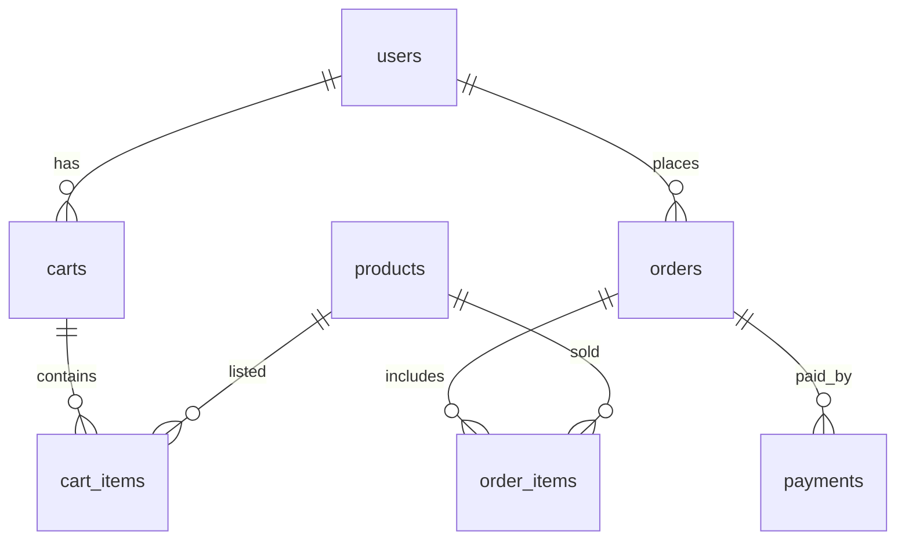

# Database Schema Documentation

This document captures everything database-related for the Final Assignment project under XAMPP. It includes the current database configuration, existing DDL (schema.sql), and a proposed minimal schema to support common ecommerce flows present in the site (accounts, products, cart, orders, etc.).

- Environment: XAMPP (MySQL)
- Character set: utf8mb4 / utf8mb4_general_ci
- Default DB name: `jannetd`
- Connection file: `sql/db.php`

## Connection settings

From `sql/db.php`:

- Host: `127.0.0.1`
- User: `root`
- Password: (empty by default in XAMPP)
- Database: `jannetd`
- Charset: `utf8mb4`

PHP include example:

```php
include_once __DIR__ . '/sql/db.php';
```

## Current schema.sql

Path: `sql/schema.sql`

```sql
CREATE DATABASE IF NOT EXISTS `jannetd`
  DEFAULT CHARACTER SET = utf8mb4
  DEFAULT COLLATE = utf8mb4_general_ci;

USE `jannetd`;

-- Example tables (uncomment/extend as needed)
-- CREATE TABLE IF NOT EXISTS users (
--   id INT AUTO_INCREMENT PRIMARY KEY,
--   email VARCHAR(255) NOT NULL UNIQUE,
--   password_hash VARCHAR(255) NOT NULL,
--   name VARCHAR(100) NOT NULL,
--   created_at TIMESTAMP DEFAULT CURRENT_TIMESTAMP
-- );

-- CREATE TABLE IF NOT EXISTS products (
--   id INT AUTO_INCREMENT PRIMARY KEY,
--   code VARCHAR(50) UNIQUE,
--   name VARCHAR(255) NOT NULL,
--   price DECIMAL(10,2) NOT NULL,
--   category VARCHAR(100),
--   image_url VARCHAR(255),
--   created_at TIMESTAMP DEFAULT CURRENT_TIMESTAMP
-- );
```

Currently, the example tables are commented out. If you want to create minimal working tables, see the Proposed schema below.

## Proposed minimal ecommerce schema

The pages in this project (e.g., `Myaccount`, `cart`, `placeorder`, `payment`, `mens`, `womens`, product pages like `J001.php` …) imply a classic catalog + cart + order flow. Below is a compact schema aligned with those flows. You can copy this into `sql/schema.sql` (uncomment/replace) and run once.

### Tables

1) users
- id INT PK, AUTO_INCREMENT
- email VARCHAR(255) NOT NULL UNIQUE
- password_hash VARCHAR(255) NOT NULL
- name VARCHAR(100) NOT NULL
- phone VARCHAR(30) NULL
- role ENUM('customer','admin') NOT NULL DEFAULT 'customer'
- created_at TIMESTAMP DEFAULT CURRENT_TIMESTAMP

2) products
- id INT PK, AUTO_INCREMENT
- code VARCHAR(50) UNIQUE
- name VARCHAR(255) NOT NULL
- description TEXT NULL
- price DECIMAL(10,2) NOT NULL
- category VARCHAR(100) NULL
- image_url VARCHAR(255) NULL
- stock INT NOT NULL DEFAULT 0
- is_active TINYINT(1) NOT NULL DEFAULT 1
- created_at TIMESTAMP DEFAULT CURRENT_TIMESTAMP

3) carts
- id INT PK, AUTO_INCREMENT
- user_id INT NOT NULL -> FK users(id)
- status ENUM('open','converted','abandoned') NOT NULL DEFAULT 'open'
- created_at TIMESTAMP DEFAULT CURRENT_TIMESTAMP
- updated_at TIMESTAMP NULL DEFAULT NULL ON UPDATE CURRENT_TIMESTAMP

4) cart_items
- id INT PK, AUTO_INCREMENT
- cart_id INT NOT NULL -> FK carts(id)
- product_id INT NOT NULL -> FK products(id)
- quantity INT NOT NULL DEFAULT 1
- unit_price DECIMAL(10,2) NOT NULL -- snapshot of price when added
- UNIQUE(cart_id, product_id)

5) orders
- id INT PK, AUTO_INCREMENT
- user_id INT NOT NULL -> FK users(id)
- cart_id INT NULL -> FK carts(id) -- optional link to originating cart
- total DECIMAL(10,2) NOT NULL
- status ENUM('pending','paid','shipped','completed','cancelled') NOT NULL DEFAULT 'pending'
- shipping_address VARCHAR(255) NULL
- billing_address VARCHAR(255) NULL
- created_at TIMESTAMP DEFAULT CURRENT_TIMESTAMP
- paid_at DATETIME NULL

6) order_items
- id INT PK, AUTO_INCREMENT
- order_id INT NOT NULL -> FK orders(id)
- product_id INT NOT NULL -> FK products(id)
- quantity INT NOT NULL
- unit_price DECIMAL(10,2) NOT NULL -- price at time of order

7) payments
- id INT PK, AUTO_INCREMENT
- order_id INT NOT NULL -> FK orders(id)
- method ENUM('card','cod','wallet','bank') NOT NULL
- amount DECIMAL(10,2) NOT NULL
- status ENUM('initiated','authorized','captured','failed','refunded') NOT NULL DEFAULT 'initiated'
- transaction_ref VARCHAR(100) NULL
- created_at TIMESTAMP DEFAULT CURRENT_TIMESTAMP

8) admins (optional if you want separate table)
- user_id INT PK -> FK users(id)
- is_super TINYINT(1) NOT NULL DEFAULT 0

### MySQL DDL (copy/paste)

```sql
CREATE DATABASE IF NOT EXISTS `jannetd`
  DEFAULT CHARACTER SET = utf8mb4
  DEFAULT COLLATE = utf8mb4_general_ci;
USE `jannetd`;

CREATE TABLE IF NOT EXISTS users (
  id INT AUTO_INCREMENT PRIMARY KEY,
  email VARCHAR(255) NOT NULL UNIQUE,
  password_hash VARCHAR(255) NOT NULL,
  name VARCHAR(100) NOT NULL,
  phone VARCHAR(30) NULL,
  role ENUM('customer','admin') NOT NULL DEFAULT 'customer',
  created_at TIMESTAMP DEFAULT CURRENT_TIMESTAMP
) ENGINE=InnoDB DEFAULT CHARSET=utf8mb4;

CREATE TABLE IF NOT EXISTS products (
  id INT AUTO_INCREMENT PRIMARY KEY,
  code VARCHAR(50) UNIQUE,
  name VARCHAR(255) NOT NULL,
  description TEXT NULL,
  price DECIMAL(10,2) NOT NULL,
  category VARCHAR(100) NULL,
  image_url VARCHAR(255) NULL,
  stock INT NOT NULL DEFAULT 0,
  is_active TINYINT(1) NOT NULL DEFAULT 1,
  created_at TIMESTAMP DEFAULT CURRENT_TIMESTAMP,
  INDEX idx_products_category (category)
) ENGINE=InnoDB DEFAULT CHARSET=utf8mb4;

CREATE TABLE IF NOT EXISTS carts (
  id INT AUTO_INCREMENT PRIMARY KEY,
  user_id INT NOT NULL,
  status ENUM('open','converted','abandoned') NOT NULL DEFAULT 'open',
  created_at TIMESTAMP DEFAULT CURRENT_TIMESTAMP,
  updated_at TIMESTAMP NULL DEFAULT NULL ON UPDATE CURRENT_TIMESTAMP,
  CONSTRAINT fk_carts_user FOREIGN KEY (user_id) REFERENCES users(id) ON DELETE CASCADE
) ENGINE=InnoDB DEFAULT CHARSET=utf8mb4;

CREATE TABLE IF NOT EXISTS cart_items (
  id INT AUTO_INCREMENT PRIMARY KEY,
  cart_id INT NOT NULL,
  product_id INT NOT NULL,
  quantity INT NOT NULL DEFAULT 1,
  unit_price DECIMAL(10,2) NOT NULL,
  UNIQUE KEY uq_cart_product (cart_id, product_id),
  CONSTRAINT fk_cart_items_cart FOREIGN KEY (cart_id) REFERENCES carts(id) ON DELETE CASCADE,
  CONSTRAINT fk_cart_items_product FOREIGN KEY (product_id) REFERENCES products(id)
) ENGINE=InnoDB DEFAULT CHARSET=utf8mb4;

CREATE TABLE IF NOT EXISTS orders (
  id INT AUTO_INCREMENT PRIMARY KEY,
  user_id INT NOT NULL,
  cart_id INT NULL,
  total DECIMAL(10,2) NOT NULL,
  status ENUM('pending','paid','shipped','completed','cancelled') NOT NULL DEFAULT 'pending',
  shipping_address VARCHAR(255) NULL,
  billing_address VARCHAR(255) NULL,
  created_at TIMESTAMP DEFAULT CURRENT_TIMESTAMP,
  paid_at DATETIME NULL,
  CONSTRAINT fk_orders_user FOREIGN KEY (user_id) REFERENCES users(id),
  CONSTRAINT fk_orders_cart FOREIGN KEY (cart_id) REFERENCES carts(id)
) ENGINE=InnoDB DEFAULT CHARSET=utf8mb4;

CREATE TABLE IF NOT EXISTS order_items (
  id INT AUTO_INCREMENT PRIMARY KEY,
  order_id INT NOT NULL,
  product_id INT NOT NULL,
  quantity INT NOT NULL,
  unit_price DECIMAL(10,2) NOT NULL,
  CONSTRAINT fk_order_items_order FOREIGN KEY (order_id) REFERENCES orders(id) ON DELETE CASCADE,
  CONSTRAINT fk_order_items_product FOREIGN KEY (product_id) REFERENCES products(id)
) ENGINE=InnoDB DEFAULT CHARSET=utf8mb4;

CREATE TABLE IF NOT EXISTS payments (
  id INT AUTO_INCREMENT PRIMARY KEY,
  order_id INT NOT NULL,
  method ENUM('card','cod','wallet','bank') NOT NULL,
  amount DECIMAL(10,2) NOT NULL,
  status ENUM('initiated','authorized','captured','failed','refunded') NOT NULL DEFAULT 'initiated',
  transaction_ref VARCHAR(100) NULL,
  created_at TIMESTAMP DEFAULT CURRENT_TIMESTAMP,
  CONSTRAINT fk_payments_order FOREIGN KEY (order_id) REFERENCES orders(id) ON DELETE CASCADE
) ENGINE=InnoDB DEFAULT CHARSET=utf8mb4;

-- Optional admin mapping if not using role in users
-- CREATE TABLE IF NOT EXISTS admins (
--   user_id INT PRIMARY KEY,
--   is_super TINYINT(1) NOT NULL DEFAULT 0,
--   CONSTRAINT fk_admins_user FOREIGN KEY (user_id) REFERENCES users(id) ON DELETE CASCADE
-- ) ENGINE=InnoDB DEFAULT CHARSET=utf8mb4;
```

### ER Diagram (Mermaid)



## Seed data (optional)

```sql
INSERT INTO users (email, password_hash, name)
VALUES ('admin@example.com', '$2y$10$examplehash', 'Admin User');

INSERT INTO products (code, name, price, category, image_url, stock)
VALUES
 ('J001', 'Euro Coat', 129.99, 'mens', 'Images/Euro Coat.avif', 10),
 ('J002', 'Hawaiian Printed Shirt', 39.99, 'mens', 'Images/Hawallian printed shirts.avif', 25),
 ('J003', 'Rosered Long Frock', 79.99, 'womens', 'Images/Rosered Long Frock.avif', 15);
```

## Maintenance

- Backups: Use `mysqldump jannetd > backup.sql` regularly.
- Charset: Always enforce `utf8mb4`.
- Indexes: Add specific indexes on frequently filtered columns (e.g., products(category), orders(status), payments(status)).
- Data safety: Use prepared statements (`db_query` helper) for all dynamic queries to avoid SQL injection.

## How to apply

1) Ensure MySQL is running in XAMPP.
2) Open phpMyAdmin, create database `jannetd` or run the DDL above.
3) Put the DDL into `sql/schema.sql` and execute once.
4) Keep this document updated when schema changes.
